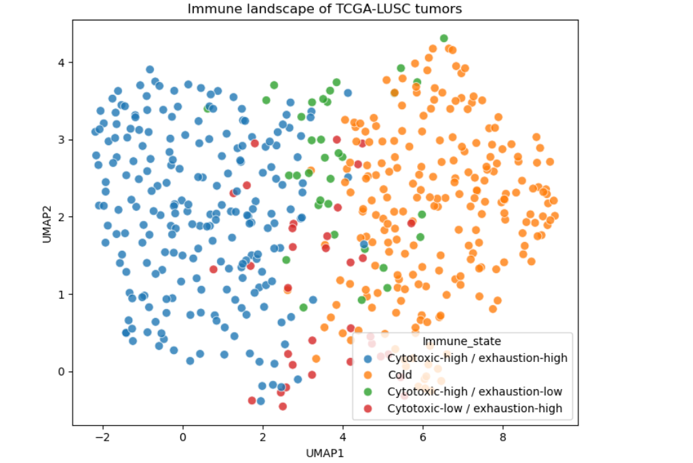
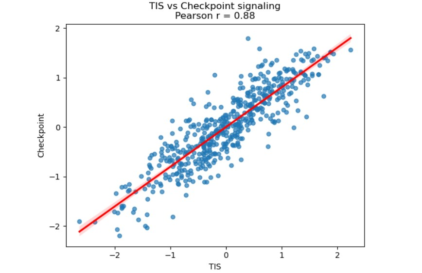
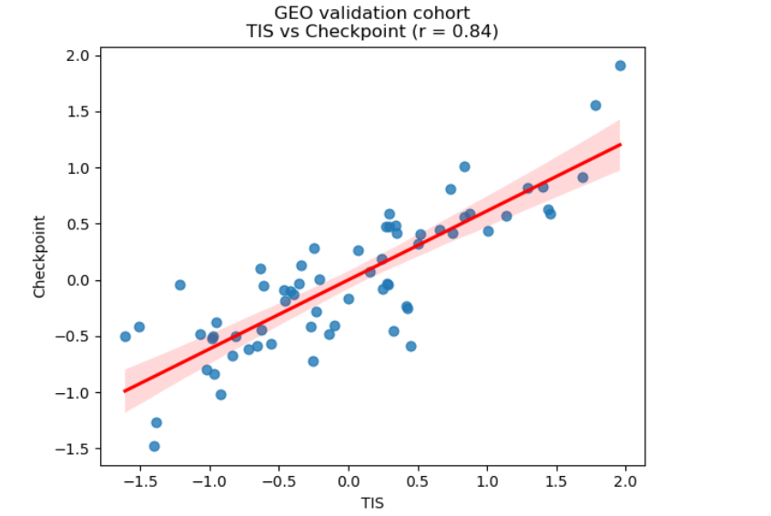
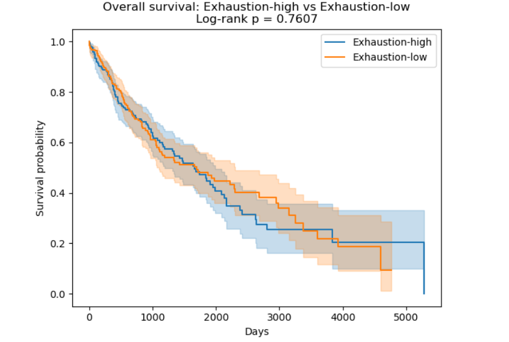
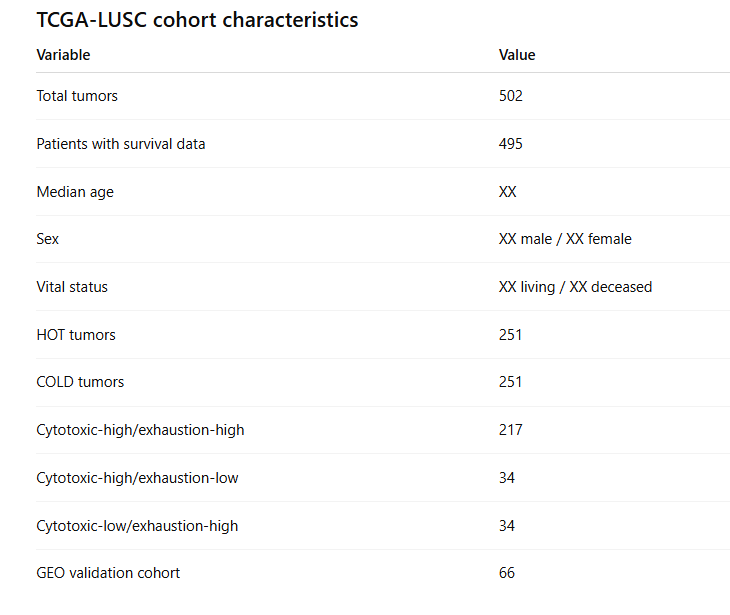

# Transcriptomic Immune Profiling in Lung Squamous Cell Carcinoma (LUSC)

Transcriptomic immune profiling framework for characterizing immune activation, checkpoint signaling, and exhaustion-associated immune states in lung squamous cell carcinoma (LUSC) using TCGA and GEO datasets.

---

## Project Overview

This project investigates the immune landscape of lung squamous cell carcinoma (LUSC) using bulk transcriptomic datasets from:

- **TCGA-LUSC (The Cancer Genome Atlas)**
- **GEO GSE37745 external validation cohort**

The analysis focuses on:

- Tumor inflammation signatures (TIS)
- Cytotoxic T-cell activity
- T-cell exhaustion programs
- Immune checkpoint signaling
- Tertiary lymphoid structure (TLS) signatures
- Immune landscape visualization using UMAP
- Survival analysis of immune states

The study identifies reproducible associations between immune activation and checkpoint signaling across independent cohorts.

---

## Project Highlights

✔ TCGA-LUSC transcriptomic analysis

✔ External validation using GEO GSE37745

✔ Tumor inflammation signature (TIS)

✔ T-cell exhaustion profiling

✔ Immune checkpoint signaling analysis

✔ UMAP immune landscape visualization

✔ Kaplan–Meier survival analysis

✔ Reproducible Python workflow

---

## Key Findings

- Identification of heterogeneous immune states in LUSC tumors

- Strong correlation between immune activation and checkpoint signaling:

  - **TCGA-LUSC:** Pearson r = 0.88
  - **GEO GSE37745:** Pearson r = 0.84

- Distinct immune-cold and exhaustion-associated tumor phenotypes

- Reproducible immune organization visualized using UMAP

- No statistically significant overall survival differences between immune activation groups

---

## Main Figures

### Figure 1. Transcriptomic Immune Landscape



### Figure 2. Immune Activation and Checkpoint Signaling



### Figure 3. External Validation



### Figure 4. Kaplan–Meier Survival Analysis



### Table 1. Clinical and Transcriptomic Characteristics



---

## Potential Clinical Relevance

This project provides a transcriptomic framework for characterizing immune heterogeneity in lung squamous cell carcinoma (LUSC).

Potential applications include:

- Immune stratification of tumors
- Identification of immune-cold versus inflamed tumors
- Biomarker discovery for immunotherapy research
- Investigation of adaptive immune resistance mechanisms
- Translational cancer immunology studies
- Hypothesis generation for future checkpoint inhibitor research

Importantly, this project is intended for research and educational purposes and is not designed for clinical decision-making.

---

## Immune Signatures

### Tumor Inflammation Signature (TIS)

```text
CXCL9
CXCL10
CXCL11
IDO1
STAT1
HLA-DRA
IFNG
CD8A
GZMB
PRF1
```

### Cytotoxicity Signature

```text
CD8A
CD8B
NKG7
PRF1
GNLY
GZMB
```

### Exhaustion Signature

```text
PDCD1
CTLA4
LAG3
TIGIT
HAVCR2
TOX
ENTPD1
```

### TLS Signature

```text
CCL19
CCL21
CXCL13
CCR7
CXCR5
CD79A
MS4A1
```

### Checkpoint Signaling Signature

```text
PDCD1
CD274
CTLA4
TIGIT
LAG3
HAVCR2
IDO1
ENTPD1
```

---

## Immune State Classification

Tumors were stratified into four transcriptomic immune states:

1. Cytotoxic-high / exhaustion-high
2. Cytotoxic-high / exhaustion-low
3. Cytotoxic-low / exhaustion-high
4. Immune-cold tumors

Classification was based on median-based signature thresholds across the TCGA-LUSC cohort.

---

## Methods Summary

### Data Sources

- TCGA-LUSC transcriptomic data
- TCGA-LUSC clinical data
- GEO GSE37745 validation cohort

### Analytical Workflow

- Gene expression normalization using z-score scaling
- Signature score calculation
- UMAP dimensionality reduction
- Correlation analysis
- Immune state classification
- Kaplan–Meier survival analysis

### Technologies

- Python 3.12
- pandas
- NumPy
- SciPy
- seaborn
- matplotlib
- lifelines
- umap-learn

---

## Repository Structure

```text
lusc-immune-escape-analysis/
│
├── data/
│   ├── tcga/
│   └── geo/
│
├── notebooks/
│   ├── preprocessing.ipynb
│   ├── immune_signatures.ipynb
│   ├── umap_analysis.ipynb
│   └── survival_analysis.ipynb
│
├── scripts/
│   ├── preprocessing.py
│   ├── signatures.py
│   ├── visualization.py
│   └── survival.py
│
├── figures/
│
├── results/
│
├── requirements.txt
│
└── README.md
```

---

## Installation

```bash
git clone https://github.com/ag48665/lusc-immune-escape-analysis.git

cd lusc-immune-escape-analysis

pip install -r requirements.txt
```

---

## Example Workflow

### 1. Preprocess transcriptomic data

```bash
python scripts/preprocessing.py
```

### 2. Calculate immune signatures

```bash
python scripts/signatures.py
```

### 3. Generate immune landscape visualization

```bash
python scripts/visualization.py
```

### 4. Run survival analysis

```bash
python scripts/survival.py
```

---

## Results and Validation

The analysis demonstrates that highly inflamed tumors exhibit coordinated activation of inhibitory immune regulatory programs associated with T-cell exhaustion and adaptive immune resistance.

Key findings were independently validated in the GEO GSE37745 cohort, confirming the reproducibility of the immune activation–checkpoint signaling relationship across datasets.

---

## Skills Demonstrated

### Cancer Bioinformatics

- Cancer transcriptomics
- Tumor immunology
- Immune profiling
- Biomarker exploration

### Data Science

- Dimensionality reduction
- Correlation analysis
- Statistical analysis
- Survival analysis

### Programming

- Python
- Pandas
- NumPy
- SciPy
- Matplotlib
- Seaborn

### Research

- Reproducible computational workflows
- Translational bioinformatics
- Biological interpretation
- Scientific reporting

---

## Future Work

Potential future extensions include:

- Immunotherapy-treated cohorts
- Spatial transcriptomics integration
- Single-cell validation
- Multi-omics integration
- Machine learning-based immune classification
- Predictive immunotherapy biomarkers

---

## License

MIT License

---

## Author

**Agata Gabara**

MSc Bioinformatics Student

Research Interests:

- Cancer Genomics
- Tumor Immunology
- Transcriptomics
- Computational Oncology
- Precision Medicine

GitHub: https://github.com/ag48665

LinkedIn: https://www.linkedin.com/in/agatha-gabara-06494a37/
