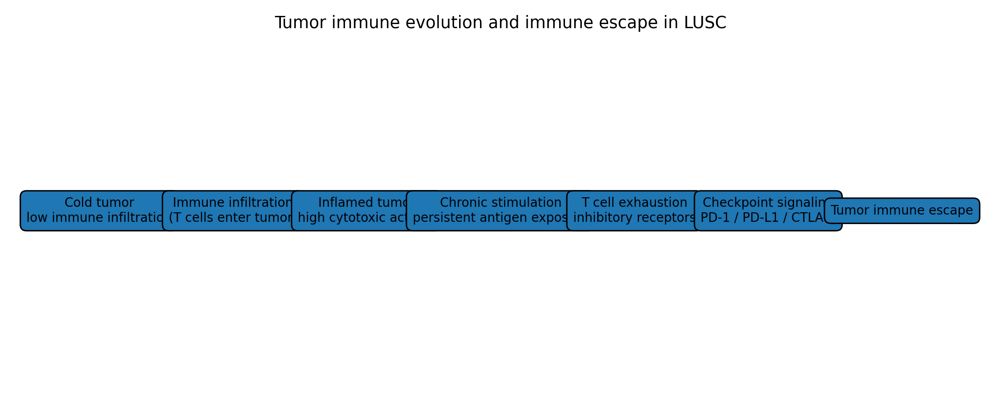
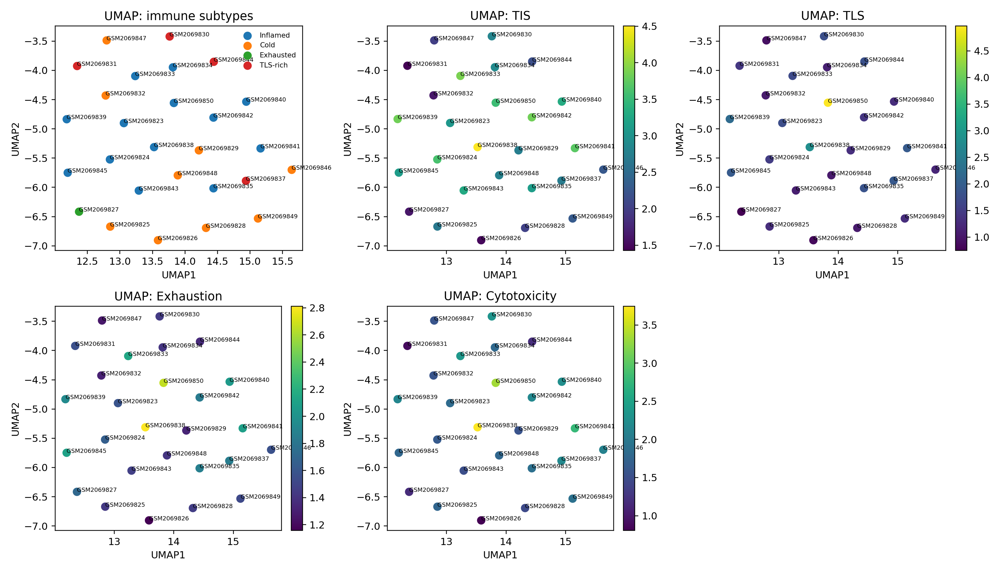
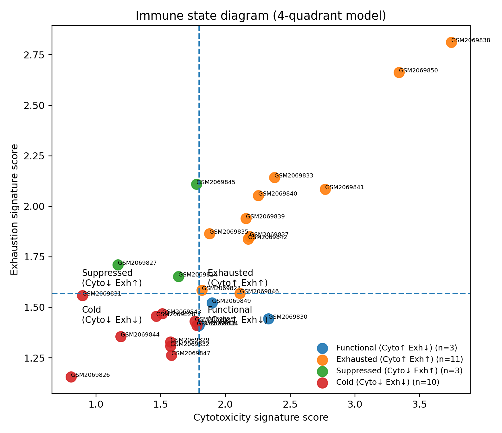

# Immune Landscape and Immune Escape in LUSC

Computational analysis of the **immune microenvironment in lung squamous cell carcinoma (LUSC)** using immune gene signatures, dimensionality reduction, and machine learning.

This repository explores how **immune activation, cytotoxicity, tertiary lymphoid structures (TLS), and T-cell exhaustion** shape tumor immune phenotypes and drive mechanisms of **immune escape**.

---

# Graphical Abstract

Conceptual model of immune landscape organization and progression toward immune exhaustion in LUSC tumors.

---

# Study Overview

Tumor immune microenvironments show substantial heterogeneity across patients. Understanding these differences is critical for predicting response to immunotherapy and identifying mechanisms of tumor immune evasion.

This study quantifies four immune gene signatures:

- **Tumor Inflammation Signature (TIS)**
- **Cytotoxic T-cell activity**
- **T-cell exhaustion**
- **Tertiary lymphoid structures (TLS)**

These immune programs capture major axes of tumor immune behavior.

---

# Key Findings

## Immune landscape reveals distinct tumor phenotypes

UMAP projection of immune signatures revealed heterogeneous tumor immune landscapes with four major phenotypes:

- Inflamed
- Cold
- TLS-rich
- Exhausted

Inflamed tumors display strong immune activation and cytotoxic signaling, while Cold tumors show minimal immune infiltration.

---

## Machine learning identifies immune activation as the dominant driver

A **Random Forest classifier** was trained using immune signatures.

Results:

- Cross-validated accuracy ≈ **0.74**
- Most informative feature: **Tumor Inflammation Signature (TIS)**
- Additional contributors: **TLS** and **cytotoxic activity**

These findings indicate that **global immune activation is the primary axis structuring immune heterogeneity in LUSC tumors**.

---

## Immune activation correlates with checkpoint signaling

Checkpoint signaling score was computed using the expression of key immune checkpoint genes:

PDCD1
CD274
CTLA4
LAG3
TIGIT
HAVCR2
ENTPD1
TOX

Immune activation strongly correlates with checkpoint signaling, suggesting a **negative feedback mechanism that limits anti-tumor immunity**.

---

## Immune state model

Tumors were classified into immune states based on cytotoxicity and exhaustion.

| Immune State | Cytotoxicity | Exhaustion |
|---|---|---|
| Cold | Low | Low |
| Functional | High | Low |
| Suppressed | Low | High |
| Exhausted | High | High |

Exhausted tumors show significantly higher checkpoint signaling.

---

## Immune trajectory model

The data suggest a potential progression:

Cold → Functional cytotoxic → Exhausted → Immune escape

Chronic immune stimulation may drive progressive **T-cell exhaustion and checkpoint activation**.

---

# Example Figures

## Immune landscape

UMAP projection of immune signatures revealing heterogeneous tumor immune phenotypes.

---

## Immune activation vs checkpoint signaling

Immune activation strongly correlates with checkpoint expression across tumors.

---

## Immune state diagram

Functional and dysfunctional immune states defined by cytotoxicity and exhaustion.

---

# Repository Structure
lusc-immune-escape-analysis
│
├── figures/ # Final manuscript figures
├── results_safe/ # Additional plots and exploratory analyses
├── LUSC_immune_escape_analysis.ipynb
├── genes.tsv
└── README.md

---

# Methods

Computational approaches used:

- RNA-seq immune signature scoring
- UMAP dimensionality reduction
- Random Forest classification
- Feature importance analysis
- Correlation analysis
- Immune state modeling
- Pathway enrichment analysis
- Gene network analysis

---

# Technologies

Python ecosystem:

- Python
- Pandas
- NumPy
- Scikit-learn
- Matplotlib
- Seaborn
- UMAP
- Jupyter Notebook

---

# Biological Interpretation

The results support a model in which:

1. Tumor immune activation promotes cytotoxic anti-tumor responses  
2. Chronic immune stimulation induces checkpoint signaling  
3. Persistent checkpoint activation drives **T-cell exhaustion**  
4. This leads to **immune escape**

Understanding these transitions may help identify tumors responsive to **immune checkpoint blockade therapies**.

---

# Citation

If you use this repository or analysis framework, please cite:

Immune Landscape and Immune Escape in LUSC
Computational analysis of tumor immune phenotypes using immune gene signatures and machine learning.

---

# Author

# Agata Gabara

Bioinformatics project exploring **immune heterogeneity and immune escape mechanisms in lung cancer**.
